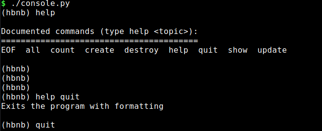
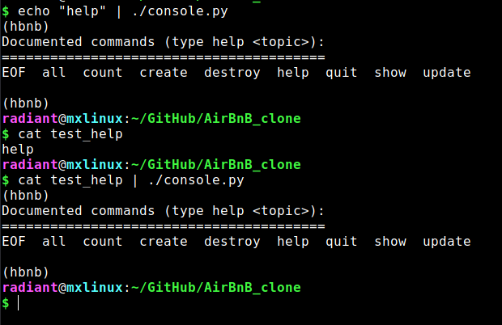
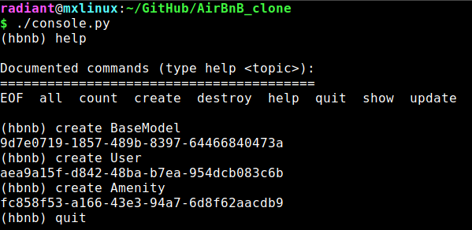
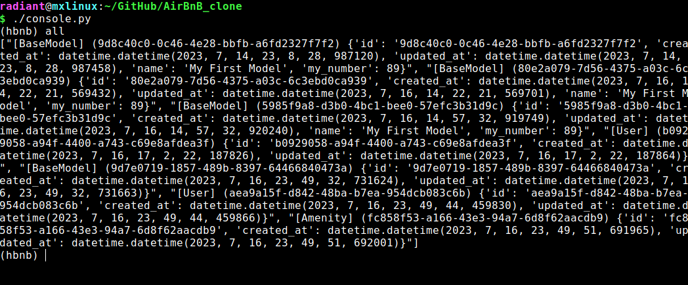
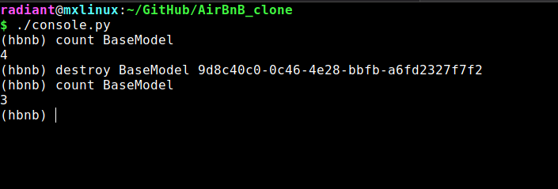

# **0x00. AirBnB clone - The console**


## **Project Description**
 * This is the first part of the project aimed at cloning the Airbnb website.
 * In this project, we worked on the project's backend and then interfaced it with a console.
 * The console was developed using the `cmd` module in Python.
 * The console enables us to interact with the backend, hence, allowing us to manipulate data.
 * It is useful since it allows us to experiment on the most appropriate functionalities to integrate into the application before it is deployed to the public (general users).
 * Data generated in the application is stored in a .json file.
    + This ensures that data does not get destroyed once we have exited the application.
    + As a result, this makes the application persistent beyond a single session.

## **Application Components**
### **Command Line Interpreter**
The command line interpreter provides an interface through which users can interact with the Application. While it functions just like a Bash shell, this command line interpreter has a limited number of accepted commands. These commands are specially designed for enabling users to manipulate data while interacting the Application.

Some of the available commands include:
* quit
* update
* destroy
* EOF
* count
* show
* help

**NOTE**: To get a full list of available commands, a user can type __``` help```__ or __```?```__ in the console.

The command line interpreter allows users to interact with the backend and:
* Create new objects (such as a User or Amenity etc.)
* Retrieve objects stored in the .json file.
* Update attributes of existing objects (e.g. updating user email).
* Perform operations on objects (e.g. counting number of objects)
* Delete or destroy objects

#### **Installation**
To install the Airbnb clone Application, clone the repository of the project from GitHub.
Use the following command to clone the repository:

```
git clone https://github.com/reckafella/AirBnB_clone.git
```

Or if a user has GitHub CLI installed on their local machine (Linux Distribution), they can use:

```
gh repo clone reckafella/AirBnB_clone
```

#### **How to Use the Application**
The Airbnb clone Application can work in two modes:
 1. __Interactively__
 In interactive mode, the console displays a prompt "hbnb". Here, the user can execute a command. After each command is executed, the prompt appears, and waits for the user to input a new command. This process goes on until the user exits the program.

 When a user runs __```./console.py```__ from the root folder of this application, they are met with this interface:

 

 2. __Non-interactively__
The user can also run commands in non-interactive mode. Here, commands are passed to the console application using the pipe (|) operator. Only commands passed to the program will be processed and then the program exits.



#### **Examples Illustrating How to Use the Application:**

+ Create An Object


+ Show An Object


+ Count Objects


+ Destroy Objects



#### **Exiting the Application**
To exit the application when running in interactive mode, the user can

type __```quit```__ or __```EOF```__

or press __```Ctrl+C```__ or __```Ctrl+D```__
